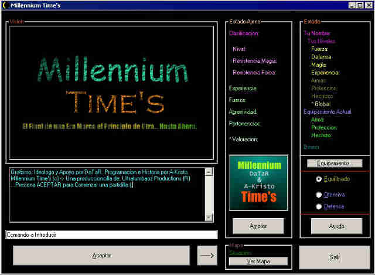

Some projects with Visual Basic 4 
================================== 
by Joan Alba Maldonado (joanalbamaldonadoNO_SPAM_PLEASE AT gmail DOT com, without NO_SPAM_PLEASE)

Three projects made with Microsoft Visual Basic 4.0.

Version: different versions 
- Date: 1997 to 1999

Description

Three projects made with Microsoft Visual Basic 4.0:

JAM Tabla BOOM (1997): a simple educative program for kids to learn the multiplication tables. I lost the source code.

Millenium Time's (1999): an RPG mixed with text adventure (interactive fiction) prototype. Not playable. Includes story and an installer. It must be installed in C:\MILLTIME.

siEmu CEE-8650 (Computer Electro Emulator 8650): An emulator / simulator prototype (not working) for the Computer Electro which was an educative toy (a kind of child computer without display that worked with sheets) for kids made by Jumbo in early 1990s (around 1992 I think). Includes some Easter eggs. It must be installed in C:\SIEMU.